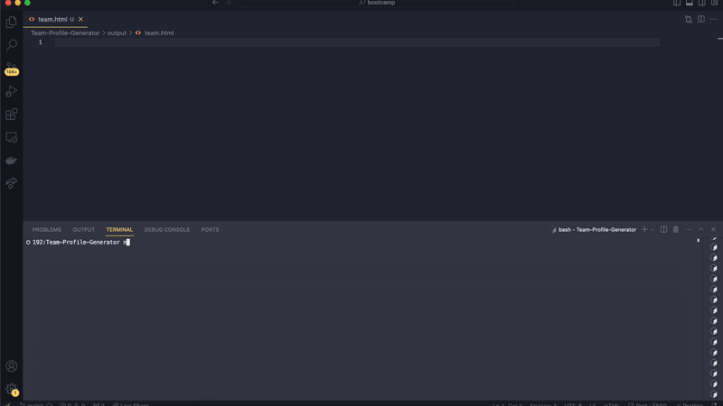

# Test-Driven Development: Team Profile Generator
[](https://opensource.org/licenses/MIT)

## Description
The Team Profile Generator is a command-line application that allows users to input information about team members and generates an HTML file displaying their profiles. It prompts the user to enter details such as name, ID, email, and role for each team member, and generates a nicely formatted HTML page with the team's profile information.

## Table of Contents
- [Features](#features)
- [Installation](#installation)
- [Usage](#usage)
- [License](#license)
- [Contributing](#contributing)
- [Screen Recording](#screen-recording)
- [Screenshots](#screenshots)
- [Questions](#questions)

## Features
- A command-line application that accepts user input with validations for different employee roles:
    - **Manager**: Name, Employee ID, Email Address and Office Number
    - **Engineer**: Name, Employee ID, Email Address and Github Username
    - **Intern**: Name, Employee ID, Email Address and School

- Generates an HTML file displaying team profiles.


## Installation
1. Make sure you have Node.js installed on your system.
2. Clone this repository to your local machine or download the source code as a ZIP file and extract it.

## Usage

1. Open your terminal or command prompt.
2. Navigate to the directory where you cloned or extracted the repository.
3. Run the following command to install dependencies:

````
npm install
````

Run the application with the following command:
````
node index.js
````

Test the application with the following command:
````
npm run test
````

## License
This project is licensed under the [MIT License](LICENSE).

## Contributing
Contributions are welcome! If you find any issues or have suggestions for improvement, please open an issue or create a pull request.

## Screen Recording


## Screenshots
HTML file generated using the application


Passed tests


## Questions
Follow me on Github at https://github.com/caseygirlyn.

Feel free to reach out to me for any inquiries at [casey.girlyn@gmail.com](mailto:casey.girlyn@gmail.com).

[](https://www.buymeacoffee.com/caseygirlyn)
[](https://www.npmjs.com/)
[](https://nodejs.org/)
